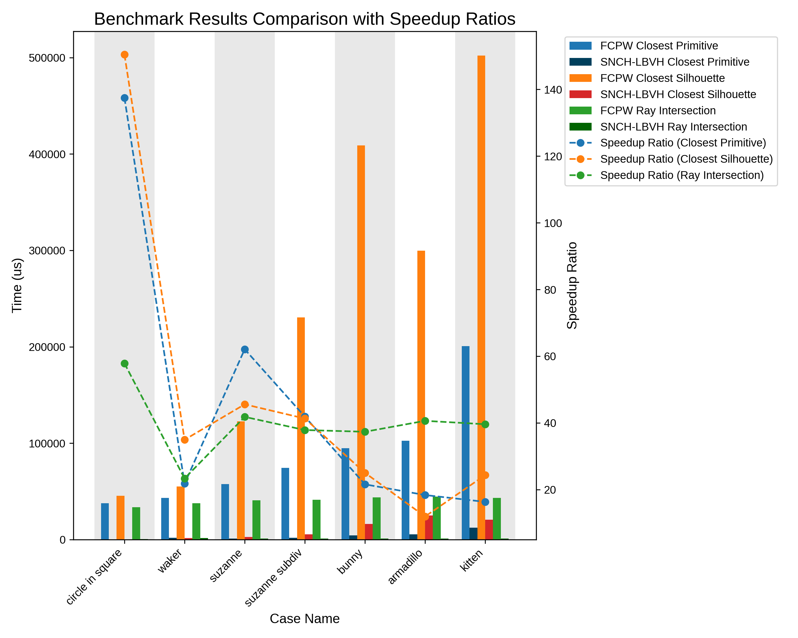

# SNCH-LBVH (Early Release)

A tiny and fast implementation of the spatialized normal cone hierarchy (SNCH) based on a linear BVH (LBVH) for Monte Carlo PDE research. A native alternative to the [fcpw](https://github.com/rohan-sawhney/fcpw) library on CUDA.

This library is used in [elaina](https://github.com/tyanyuy3125/elaina), the wavefront-style implementation of walk on stars, and the ACM SIGGRAPH 2025 paper *Guiding-Based Importance Sampling for Walk on Stars* ([Project Page](https://illumiart.net/the-guiding-stars)).

**Early release code may contain performance issues and implementation bugs**, feel free to post issues or open pull requests.

## Functionalities

This library supports three types of geometric queries:

* Nearest primitive query
* Nearest silhouette query
* Ray intersection

These queries fully cover all the geometric query functionality required by the walk on stars (WoSt) estimator.

Besides, this library supports following geometric sampling algorithm:

* SampleTriangleInSphere (Alg. 6 of WoSt paper)

## Performance

The following is a performance comparison of GPU query functions of this library (SNCH-LBVH) and fcpw (using Vulkan backend on Linux) under RTX 4090 GPU. 



## Getting started

This is a header-only library. The fcpw submodule is only used for benchmarking. If you only want to use the functions of this library, just clone it (no recursive required) and add the include folder to your project.

## Known Issues

* CPU query part does not work.
* Some functions have strange conversions from float3 to float4. The design here is not unified (considering the characteristics of GPU, all should be replaced with float4 in the future).

## Roadmap

* Fix known issues mentioned above.
* Use shared memory instead of global memory.
* Support more `.obj` face types (currently only supports triangle faces).

## Credits

The very original code base is authored by [ToruNiina](https://github.com/ToruNiina/lbvh). Later, [rsugimoto](https://github.com/rsugimoto/lbvh) edits this library to support 2D primitives and intersection operations to support the Walk on Boundary research ([WoBToolbox](https://github.com/rsugimoto/WoBToolbox)). 

I make major changes to the entire project, introducing the closest silhouette query and the closest ray intersection query.

Please keep the original `LICENSE` file from ToruNiina and give the [original project](https://github.com/ToruNiina/lbvh) a star.

## Citation

```bibtex
@inproceedings{huang2025guiding,
  title={Guiding-Based Importance Sampling for Walk on Stars},
  author={Huang, Tianyu and Ling, Jingwang and Zhao, Shuang and Xu, Feng},
  booktitle={SIGGRAPH 2025 Conference Papers},
  year={2025}
}
```

```bibtex
@software{snch-lbvh,
	author = {Huang, Tianyu},
	license = {MIT},
	month = {7},
	title = {{SNCH-LBVH: A Tiny and Fast Implementation of Spatialized Normal Cone Hierarchy on CUDA}},
	url = {https://github.com/tyanyuy3125/snch-lbvh},
	version = {1.0},
	year = {2025}
}
```
